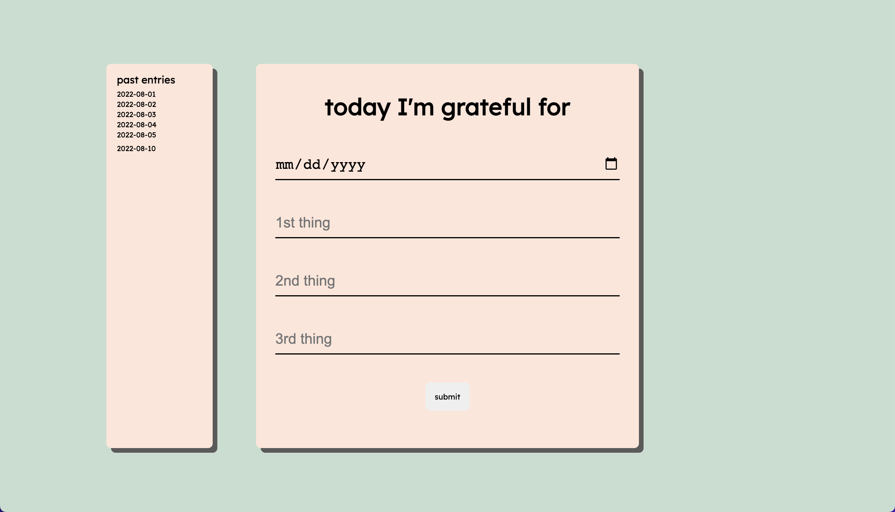

# Gratitude Journal CRUD App
A simple app that can Create, Read, Update, Delete documents from a database.

https://gratitude-journal-crud-app.herokuapp.com/

## How It's Made:

**Tech used:** HTML, CSS, JavaScript, Node, Express, MongoDB, EJS

I created a database in MongoDB to store each journal entry as a document. I built out the server API to listen for user CRUD requests using Express and ended up using a POST request for the Update function. The Read requests were built by using EJS to inject data into from MongoDB, allowing users to see their past entries into the journal.

## Lessons Learned:

I learned how to build out a server that could listen to and carry out CRUD requests. I also created and connected my server to a database. I practiced EJS syntax to plug data into a template and return that to a user. Was also able to host the application on Heroku. I spent a lot of time reading MongoDB documents, practicing reading documentation to find answers to problems in my code.